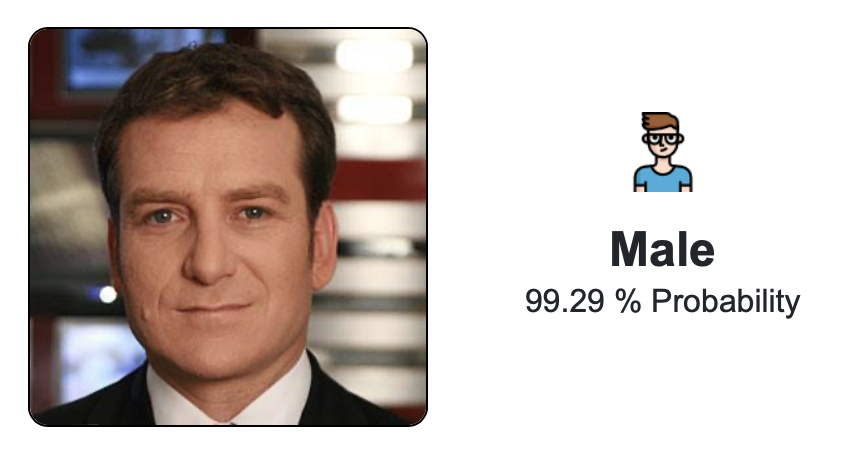
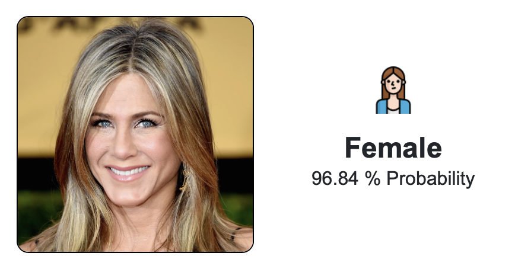
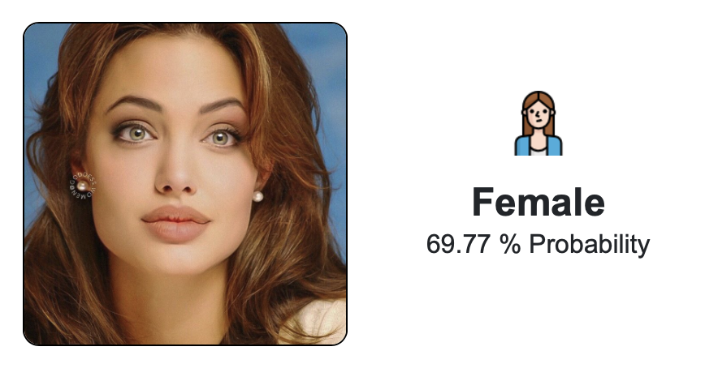
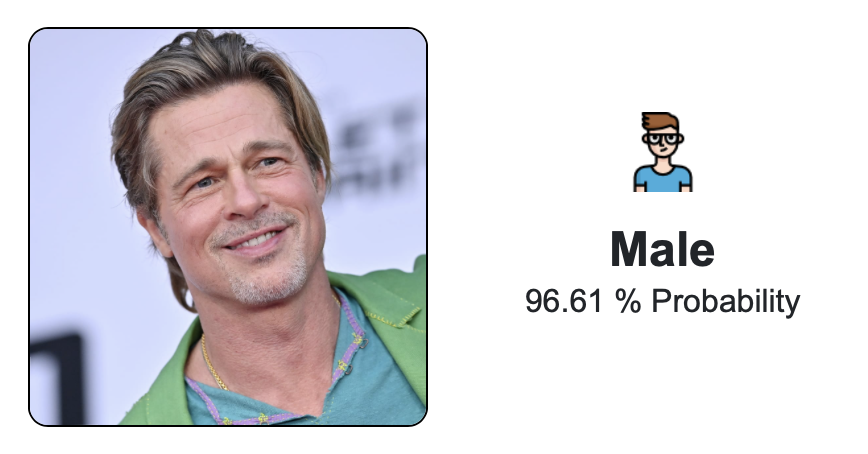

# Gender Detector

## Overview
This repository contains a PyTorch implementation of the ResNet18 architecture for binary image classification. The model was trained to classify portrait photos as 'Male' or 'Female' based on the person in the photo.

<p>
  
  
  
    
</p>

### Model Performance on Test Set (Using [CelebFaces](https://www.kaggle.com/datasets/jessicali9530/celeba-dataset/) Dataset)

| Metric       | Value  |
|--------------|--------|
| Accuracy     | 0.9699 |
| F1 Score     | 0.9701 |
| Precision    | 0.9622 |
| Recall       | 0.9781 |


### Project Documentation
The [ReportPaper.pdf](ReportPaper.pdf) file in this repository contains a comprehensive report on the development process of this project. The report includes details on the project's implementation, methodology, and the obtained results.


## Getting Started
1. Clone the repository into your local device (using ```git clone https://github.com/arielverbin/GenderDetector.git```).
2. Make sure you have installed all of the necessary dependencies (pytorch, torchvision, PIL etc.).
3. In order to use our final trained model, run the [predict.py](GenderDetector/predict.py) script using ```python3 GenderDetector/predict.py```.
4. You can also use the python server for GUI:
   - Start the server using ```python3 pythonServer/server.py```.
   - Open the HTML file ```pythonServer/GenderDetector.html``` in your browser.
  
   
